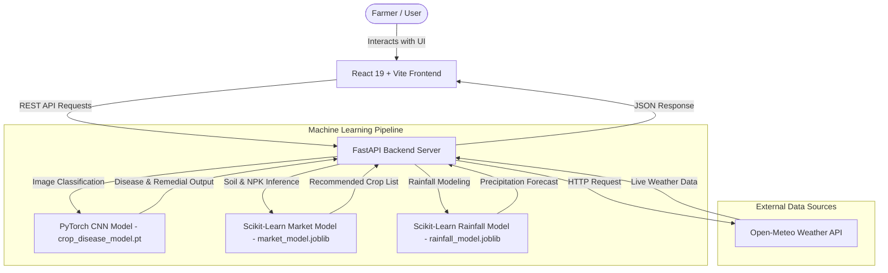

# 🌾 KrishiMitr (कृषि-मित्र) – Smart AI Agricultural Guidance Platform

[](https://krishimitr-three.vercel.app/)
[](https://krishimitr-backend.onrender.com)
[](https://python.org)
[](https://fastapi.tiangolo.com/)
[](https://pytorch.org/)
[](https://react.dev/)
[](https://www.docker.com/)

> **KrishiMitr** is an end-to-end, AI-powered agricultural advisory platform designed to empower farmers with real-time computer vision disease diagnosis, machine-learning-driven crop & soil recommendations, live weather forecasting, and bilingual (Hindi & English) accessibility.

🔗 **Live Application**: [https://krishimitr-three.vercel.app/](https://krishimitr-three.vercel.app/)  
⚡ **Backend API**: [https://krishimitr-backend.onrender.com](https://krishimitr-backend.onrender.com)  
📂 **GitHub Repository**: [https://github.com/ayushpandey3357/KRISHIMITR](https://github.com/ayushpandey3357/KRISHIMITR)

---

## 📸 Screenshots & UI Previews

<div align="center">
  
  <p><em>KrishiMitr Smart Agricultural Guidance Landing Page</em></p>
</div>

<br/>

<div align="center">
  
  
  <p><em>AI Disease Diagnosis (Left) & Smart NPK Crop Recommendation (Right)</em></p>
</div>

---

## 🌟 Key Features

- 🔬 **AI Crop Disease Diagnosis**: Upload plant leaf images to detect diseases (e.g., Yellow Rust, Rice Blast, Potato Late Blight) using a **PyTorch Deep Convolutional Neural Network (CNN)** combined with HSV spectrum color analysis, providing instant organic and chemical treatment remedies.
- 🌱 **Smart Crop Recommendation Engine**: Input NPK soil parameters (Nitrogen, Phosphorus, Potassium), pH level, soil type, and season to receive AI-curated crop suggestions powered by **Scikit-Learn ML models**.
- 🌧️ **Precipitation & Rain Risk Prediction**: Integration with Open-Meteo live weather data for real-time regional temperature, humidity, pressure, and predictive rainfall modeling.
- 🤖 **AI Krishak Virtual Assistant**: Interactive multi-lingual farming assistant providing guidance on crop management, fertilizer dosage, irrigation schedules, and government schemes.
- 🌐 **Bilingual Support (Hindi & English)**: Full multi-language interface tailored for Indian farmers with seamless language toggle across all dashboard pages.
- ⚡ **Live Backend Health Monitor**: Dynamic client-side connection indicator in the navigation bar to monitor backend API availability and gracefully notify users during free-tier cold-starts.
- 🐳 **Containerized Architecture**: Multi-container Docker & Docker Compose configuration for simplified local deployment and production readiness.

---

## 🏗️ System Architecture



---

## 💻 Tech Stack

| Category | Technology | Usage |
| :--- | :--- | :--- |
| **Frontend Framework** | **React 19 + Vite 7** | High-performance Single Page Application (SPA) |
| **Styling** | **Tailwind CSS v4** | Modern, responsive component styling & dark mode support |
| **Routing** | **React Router v6** | Client-side routing with Vercel SPA redirects |
| **Backend Framework** | **FastAPI + Uvicorn** | Asynchronous Python REST API server |
| **Deep Learning** | **PyTorch (`torch`, `torchvision`)** | CNN image classification model for crop disease detection |
| **Machine Learning** | **Scikit-Learn, Pandas, NumPy** | Feature extraction, rainfall prediction, crop recommendation |
| **External APIs** | **Open-Meteo REST API** | Live weather coordinates and meteorology integration |
| **Containerization** | **Docker & Docker Compose** | Containerized dev and production environments |
| **Hosting & CI/CD** | **Vercel & Render** | Continuous deployment for frontend static app and backend web service |

---

## 🔌 API Documentation

| Endpoint | Method | Description | Request Payload / Query |
| :--- | :---: | :--- | :--- |
| `/health` | `GET` | Health check endpoint for API and ML model availability | None |
| `/predict-disease` | `POST` | Predicts plant disease from uploaded image or sample ID | Form Data: `file` (Image) or `sampleId` (string) |
| `/recommend-crop` | `POST` | Computes optimal crops based on NPK & soil parameters | Form Data: `nitrogen`, `phosphorus`, `potassium`, `ph`, `season`, `soilType` |
| `/predict-rainfall` | `POST` | Evaluates rainfall probability and weather risk | Form Data: `region`, `season`, `temperature`, `humidity`, `pressure` |
| `/weather` | `GET` | Fetches live meteorological data via Open-Meteo | Query Param: `region` (string) |

---

## 🛠️ Project Directory Structure

```
KrishiMitr/
├── backend/
│   ├── app.py                      # FastAPI core server & endpoint routes
│   ├── Dockerfile                  # Production Docker container setup for backend
│   ├── models/                     # Trained ML & PyTorch model checkpoints
│   │   ├── crop_disease_model.pt
│   │   ├── market_model.joblib
│   │   └── rainfall_model.joblib
│   ├── recommendation_data.py      # Crop catalog & scoring logic
│   ├── weather_data.py             # Weather coordinates & region mappings
│   ├── train_disease_model.py      # CNN disease model training pipeline
│   ├── train_market_model.py       # Scikit-Learn crop recommendation trainer
│   ├── train_rainfall_model.py     # Rainfall prediction trainer
│   └── requirements.txt            # Python backend dependencies
├── frontend/
│   ├── src/
│   │   ├── components/             # Navbar, Footer, Modals, Assistant (Krishak)
│   │   ├── config/api.js           # Environment API configuration & base URL
│   │   ├── context/                # Multi-language Context (Hindi / English)
│   │   └── pages/                  # Landing, Dashboard, Disease, Weather, Recommendation
│   ├── Dockerfile                  # Frontend Docker container configuration
│   ├── package.json                # Frontend dependencies & scripts
│   ├── vite.config.js              # Vite bundler configuration
│   └── vercel.json                 # Vercel SPA routing rules
├── images/                         # UI Screenshots & visual assets
├── docker-compose.yml              # Local multi-container orchestration
├── docker-compose.prod.yml         # Production multi-container setup
├── render.yaml                     # Render Infrastructure-as-Code manifest
├── vercel.json                     # Root Vercel build & route rules
└── README.md                       # Project documentation
```

---

## 🚦 Local Setup & Running

### Prerequisites
- **Node.js**: v18+
- **Python**: v3.10+
- **Docker & Docker Compose** (Optional for containerized setup)

---

### Option A: Standard Local Setup

#### 1. Clone the Repository
```bash
git clone https://github.com/ayushpandey3357/KRISHIMITR.git
cd KRISHIMITR
```

#### 2. Set Up & Run Backend
```bash
# Install Python dependencies
pip install -r backend/requirements.txt

# Launch FastAPI development server (runs on http://localhost:8000)
python -m backend.app
```

#### 3. Set Up & Run Frontend
```bash
# Navigate to frontend folder
cd frontend

# Install Node dependencies
npm install

# Start Vite development server (runs on http://localhost:5173)
npm run dev
```

---

### Option B: Docker Setup 🐳

Run the entire application (Frontend + Backend) using Docker Compose with a single command:

```bash
docker-compose up --build
```
- **Frontend App**: `http://localhost:5173`
- **FastAPI Backend API**: `http://localhost:8000`

---

## ☁️ Deployment Guide

### **Frontend Deployment (Vercel)**
1. Connect the GitHub repository `ayushpandey3357/KRISHIMITR` to **Vercel**.
2. Configure Environment Variable:
   * `VITE_API_BASE_URL` = `https://krishimitr-backend.onrender.com`
3. Vercel automatically detects `frontend/vercel.json` and builds the static React SPA.

### **Backend Deployment (Render)**
1. Create a new **Web Service** on Render linked to the repository.
2. Build Command: `pip install -r backend/requirements.txt`
3. Start Command: `python -m backend.app`
4. Set Environment Variable:
   * `ALLOWED_ORIGINS` = `https://krishimitr-three.vercel.app`

---

## 👤 Author

**Ayush Kumar Pandey**  
🎓 B.Tech Computer Science & Engineering, BBDNIIT (Lucknow, India)  
📧 Email: [ayushpandey1974@gmail.com](mailto:ayushpandey1974@gmail.com)  
🔗 LinkedIn: [linkedin.com/in/ayushpandey3357](https://www.linkedin.com/in/ayushpandey3357)  
📂 GitHub: [github.com/ayushpandey3357](https://github.com/ayushpandey3357)  
🌐 Portfolio: [ayushpandey3357.github.io](https://ayushpandey3357.github.io/)

---

## 📜 License

This project is open-source and available under the [MIT License](LICENSE).
